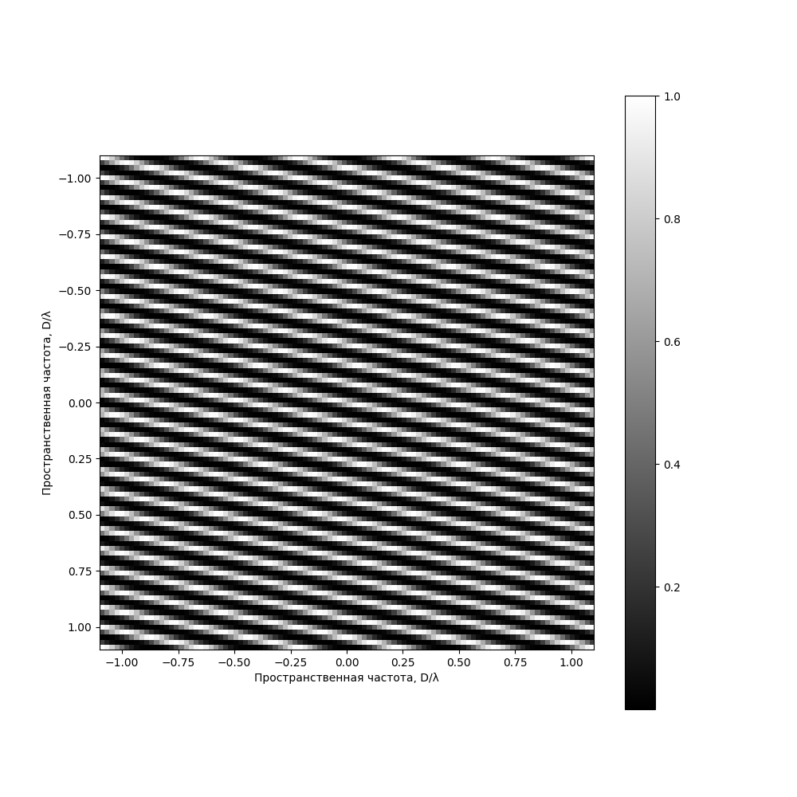
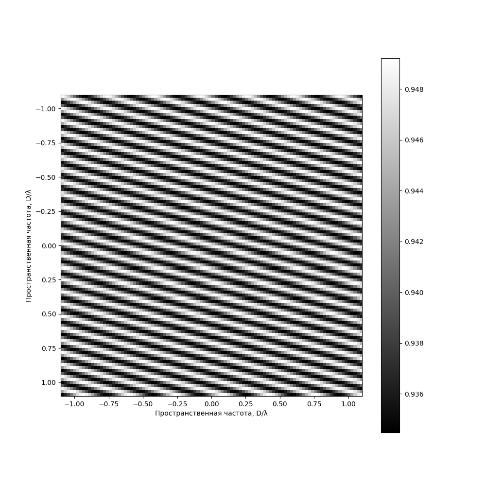

# Студенческая практика после 2го курса: спекл-интерферометрия

## Ячейка 1: вычисление master-bias

В CMOS-детекторах к сигналу прибавляется некоторое постоянное число, которое называется bias. 
Эта величина довольно постоянна, но она все равно зависит от положения на детекторе и времени. 
Для анализа стабильностиь bias получают несколько серий кадров без освещения. Здесь это 1000 кадров. 
По совокупности кадров вычисляется попиксельная медиана. Это и есть master bias:

<image src="/master_bias.png">

## Ячейка 2: получение спектра мощности изображения

Для начала, из сырого кадра с телескопа вычитается master bias. 
Далее обрезается область с исследуемым объектом. 
Для этого возьмем gauss_filter из библиотеки scipy. 
Затем находим самый яркий пиксель и обрезаем вокруг него область 100 × 100 пикселей. 
После этого нужно определить среднюю величину фона: по областям кадра вне окна с исследуемым объектом оценили среднюю величину фона и вычли из всего кадра. 
Чтобы получить спектр мощности изображения, применялось преобразовани Фурье к каждому кадру в отдельности, затем, все усреднялось. Для удобства битые кадры выкидывались.

<image src="/log_powerspectrum_cal334.png">

## Ячейка 3 и 4: редукция сторонник эффектов

Здесь на спектр мощности наложена круглая маска. Принцип ее наложения следующий: за пределами этой маски сигнала быть не должно, но он есть. 
Также нужно усреднить по азимуту: создали пустой кадр размером 100 × 100 и, вращая спектр мощности на 1°, сложили с этим пустым кадром. Затем, мы поделили полученный кадр на 360.

<image src="/masked_powerspectrum_cal334.png">

## Ячейка 5 и 6: подбор и улучшение модели

Полученный спектр мощности аппроксимируется некоторой модельной функцией. 
Изначальная модели подбирается вручную и выглядит как совокупность параллельно направленных чередующихся светлых и темных полос (см. ячейку 5). 
Затем эту модель уже компьютер подгоняет под истинный спектр. Для этого выделяем ту область на спектре (см. ячейку 4), где полосы есть.

<table><tr>
<td>Подобранная  </td>
<td>Оптимизированная  </td>
</tr></table>

Последним этапом работы была конкатенация оптимизированной модели и итогового спектра мощности  с последующим визуальным сравнением.

<image src="/concatenated_model_and_reality_cal334.png">
